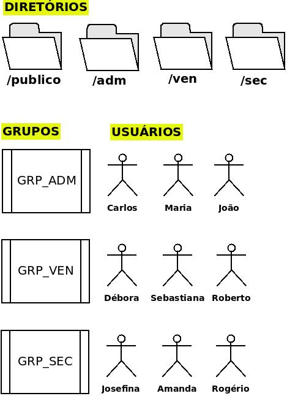

# Bootcamp-Linux do Zero DIO
### Projeto: Infraestrutura de Diretórios, Grupos e Usuários - ShellScript

 

**Script do Projeto:** [script-estrutura-diretorios-grupos-usuarios.sh](script-estrutura-diretorios-grupos-usuarios.sh)

  

> # Requisitos

* Criar diretórios /publico, /adm, /ven, /sec
* criar grupos GRP_ADM (/adm), GRP_VEN (/ven), GRP_SEC (/sec)
* Criar usuários com seus diretórios, atribuír grupos e senha padrão
* Dono de todos os diretórios será usuário root
* Dono e Grupo permissão total nos diretorios, demais grupos, nenhuma permissão (770)
* Todos os usuários terão permissão total no diretório público (777)

 

